[](https://classroom.github.com/a/WZovCNvQ)

# ITB Game Jam 2025 - Sistema de Votacions

## Resum del projecte

Aquest projecte consisteix en el desenvolupament d’un sistema de votacions per a un esdeveniment de creació de videojocs (Game Jam) dins l’Institut Tecnològic de Barcelona. El sistema està compost per una API REST amb ASP.NET Core i una interfície web amb Razor Pages, formant una arquitectura client-servidor clara i mantenible.

Per la part del servidor, es fa servir ASP.NET Core amb Entity Framework i ASP.NET Identity. La base de dades conté tres taules principals: Games, Users i Votes. La taula Users hereta d’IdentityUser i s’amplia amb un DisplayName. La taula Votes permet enregistrar cada vot associat a un usuari i a un joc concret.

Una de les limitacions dissenyades intencionadament és que només es poden registrar usuaris normals ("User") des de la pàgina pública. Els usuaris amb rol Admin s’han de registrar des del backend o mitjançant una ruta protegida. Aquesta decisió s’ha pres per evitar que qualsevol usuari pugui tenir permisos administratius, com ara editar o eliminar jocs.

Pel que fa a les votacions, s’ha implementat una restricció perquè cada usuari només pugui votar un cop per cada joc. Això es fa amb una clau única combinada (UserId, GameId) a la taula Votes. Aquest enfocament evita duplicacions i manté el recompte net de vots.

L’autenticació es fa amb JSON Web Tokens (JWT). Quan un usuari inicia sessió correctament, rep un token que s’emmagatzema en la sessió del navegador. Aquest token es fa servir per autoritzar operacions protegides com votar o accedir a zones restringides de l’API.

El client web, construït amb Razor Pages, mostra una llista dels videojocs ordenats pel nombre de vots. Cada entrada permet veure’n els detalls i, si l’usuari està autenticat, pot votar. A la pàgina de detall es mostra també la imatge del joc si està disponible.

El projecte deixa preparat un espai per integrar un sistema de xat amb SignalR, que permetria la comunicació en temps real entre usuaris autenticats.

En definitiva, aquest projecte dona una base sòlida per gestionar la participació i votació en un esdeveniment de videojocs, aplicant bones pràctiques com el control d’accessos, validació de dades, ús de DTOs, i una arquitectura clara i escalable.


### Estratègies i decisions d’implementació

- **Modelatge EF Core amb Identity**: La base de dades es basa en tres taules principals: `Games`, `Users` (extensió d'`IdentityUser`) i `Votes`. L'ús d'Identity permet una gestió segura i robusta dels usuaris.
- **Restricció d'un vot per joc per usuari**: Implementat amb una restricció única combinant `UserId` i `GameId` a la taula `Votes`, garantint que un usuari només pugui votar un joc una vegada.
- **JWT per autenticació**: L'autenticació es fa amb tokens JWT, emmagatzemats a la sessió del client per fer peticions autenticades com votar.
- **Control d'accessos**: L'atribut `[Authorize]` restringeix accions com crear, editar o eliminar jocs només a usuaris amb rol `Admin`.
- **Client Razor Pages**: El client mostra la llista de jocs ordenada per nombre de vots, pàgina de detall amb la imatge i descripció, i una funcionalitat per votar només si s’està autenticat.
- **SignalR (pendent)**: S'ha deixat preparat un espai per implementar el xat en temps real, però es considera funcionalment complet sense aquesta funcionalitat extra.

### Estructura de la solució
```txt
m09-t1-pr2-apirest-CristianSalaF/ 
├── T1PR2-APIREST/ # Projecte backend ASP.NET API 
│ ├── Controllers/ # Controllers: Videogame, Auth 
│ ├── Models/ # Entitats EF Core: Game, User, Vote │ 
├── DTOs/ # Models per a transferència de dades 
│ ├── Context/ # DbContext amb configuració d'entitats 
│ ├── Program.cs # Configuració de serveis, JWT, Identity 
│ └── appsettings.json # Connexions i configuracions 
└── T1PR2-Client/ # Projecte frontend Razor Pages 
  ├── Pages/ # Vistes: Login, Register, Index, GameDetail  i UsersXat
  ├── Model/ # Els DTO que gestionen les dades 
  ├── Program.cs # Configura HttpClient i Sessions 
  └── wwwroot/ # Recursos com el "logo" de la Game Jam i els scripts de SignalR
```
## Imatges del projecte
### Base de dades
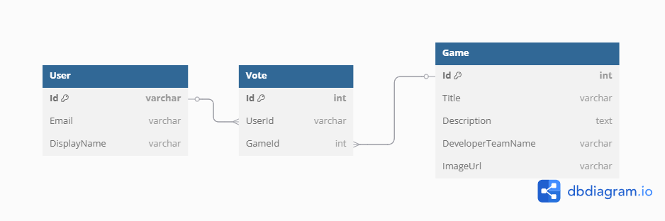
*Un usuari només pot votar cada joc una vegada

### Swagger / API
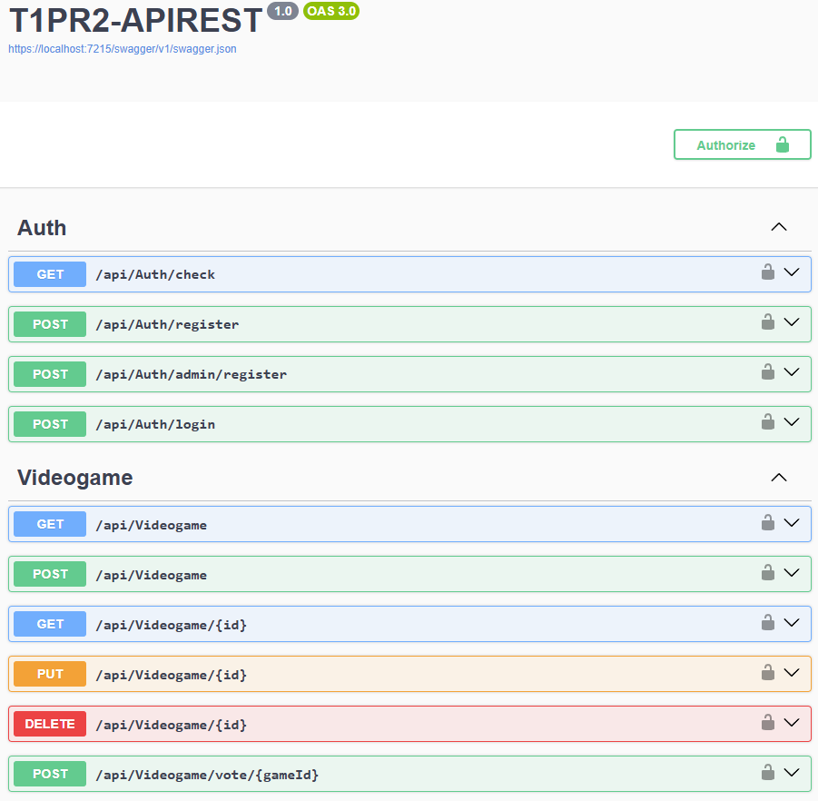

### Index 
*continguts de prova, poden diferir al enviament final
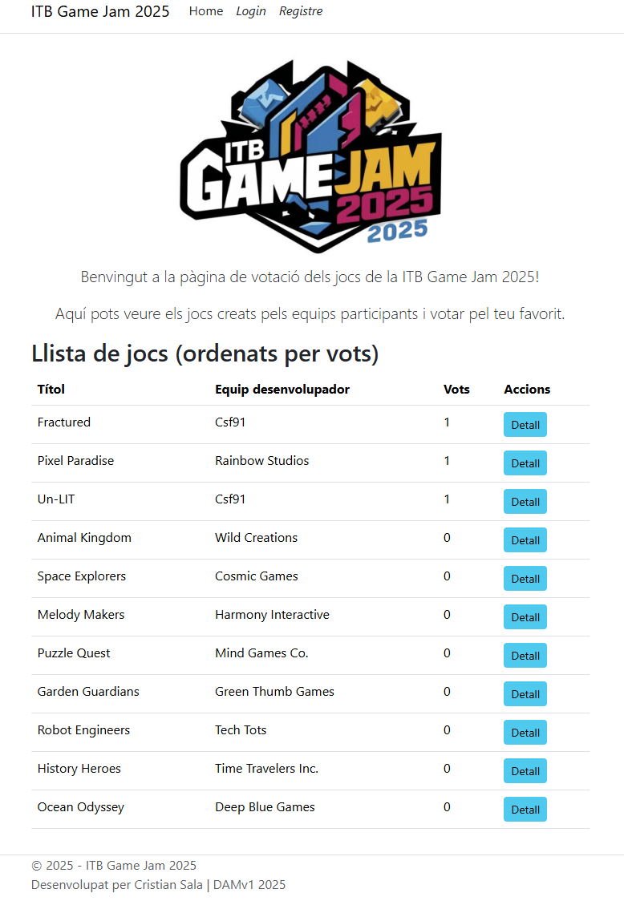

### Registre amb validació 
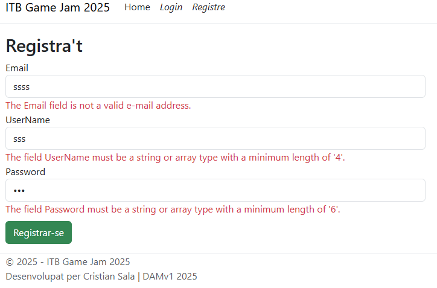

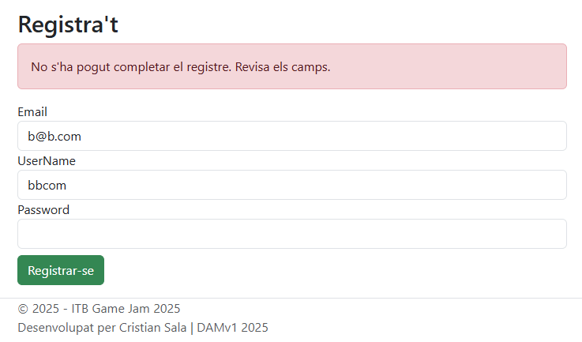

Mostra error si no compleix els requisits de seguretat (Majuscula, minuscula, nombre i simbol, amb 6 de llarg com a minim)

### Inici de sessió
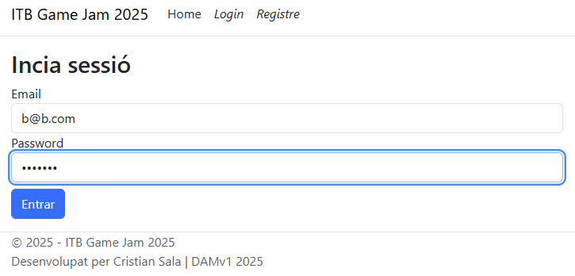

S'actualitza el header amb els enllaços al xat i a tancar sessió

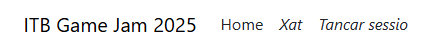

### Detalls del joc
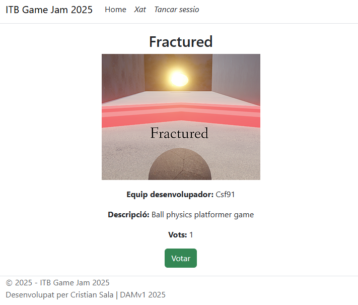

Admet imatges, al DbInit hi haurà un anomenat Un-LIT amb una imatge posada, però admeten qualssevol url publica, o si s'afegeix la imatge al projecte, la ruta relativa.

### Xat
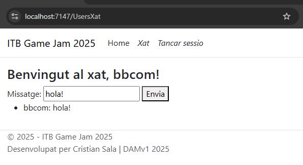
Detecta el nom del usuari i l'emplena automàticament

### Votació (a dins de game details)
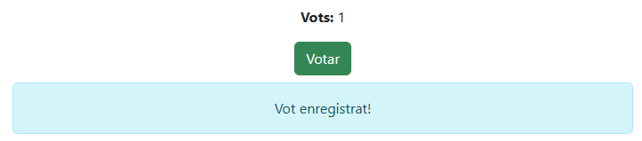

Si es torna a intentar votar: 

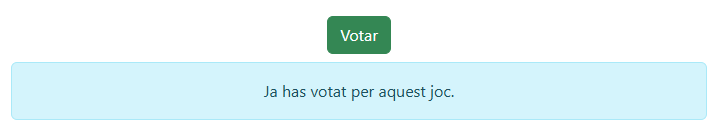

I si es tanca la sessió neteja la cookie, i recarrega el header

## Bibliografia
> Eduard Ruesga (23 de Març de 2025), M09-T1.APIrest. 
> Recuperat el 14 d'Abril de 2025 de https://github.com/eduard-ruesga-xtec/M09-T1.APIrest.

> 2013, Difference between git stash pop and git stash apply.
> Recuperat el 18/04/2025 de https://stackoverflow.com/questions/15286075/difference-between-git-stash-pop-and-git-stash-apply.

> 2010, git merge: Removing files I want to keep!
> Recuperat el 18/04/2025 de https://stackoverflow.com/questions/1407638/git-merge-removing-files-i-want-to-keep.

> Microsoft Learn, Microsoft (18 de Septembre de 2024). Session and state management in ASP.NET Core.
> Recuperat el 16 d'Abril de 2025 de https://learn.microsoft.com/en-us/aspnet/core/fundamentals/app-state?view=aspnetcore-9.0.

> Microsoft Learn, Microsoft. UserManager<TUser> Clase.
> Recuperat el 16 d'Abril de 2025 de https://learn.microsoft.com/es-es/dotnet/api/microsoft.aspnetcore.identity.usermanager-1?view=aspnetcore-9.0.
